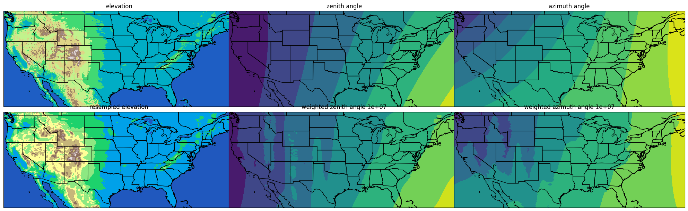

# fast_spa

This is a Cython implementation of the [NREL Solar Position Algorithm for Solar
Radiation Applications](https://www.nrel.gov/docs/fy08osti/34302.pdf).
Designed for calculating solar zenith and azimuth across a temporal and spatial
dimension.

```bash
git clone ...
python3 -m venv .venv && source .venv/bin/activate
pip install .
```

```python
import numpy as np
import fast_spa

# 200x200km area
lats = np.linspace(30, 31, 100)
lons = np.linspace(-80, -79, 100)
lats, lons = np.meshgrid(lats, lons)
datetime_obj = (
    np.arange("2023-01-01", "2023-01-02", dtype="datetime64[h]")
    .astype("datetime64[ns]")
    .astype(str)
    .tolist()
)

%timeit fast_spa.fast_spa(datetime_obj, lats, lons)
29.1 ms ± 299 µs per loop (mean ± std. dev. of 7 runs, 10 loops each)
```

There is also integration with the ETOPO2022 dataset for elevation data.

```python
import numpy as np
from numpy.typing import ArrayLike
import cartopy.crs as ccrs
import matplotlib.pyplot as plt
import fast_spa
ZENITH_ANGLE = 0
AZIMUTH_ANGLE = 1

def contourf(
    ax: GeoAxes,
    data: ArrayLike,
    lons: ArrayLike,
    lats: ArrayLike,
    title="",
    **kwargs,
) -> GeoAxes:
    ax.title.set_text(title)
    ax.coastlines()
    ax.add_feature(cfeature.STATES)
    ax.contourf(
        lons,
        lats,
        data,
        transform=ccrs.PlateCarree(),
        **kwargs,
    )
    return ax

def main(
    etopo: fast_spa.ETOPO2022 = fast_spa.ETOPO2022(),
    lons=np.linspace(-125, -65, 200),
    lats=np.linspace(25, 50, 100),
    weight: float = 1e7,
):
    fig, axes = plt.subplots(
        2, 3, figsize=(20, 6), subplot_kw={"projection": ccrs.PlateCarree()}
    )
    # - plot the non-resampled elevation data
    lons, lats = np.meshgrid(lons, lats)
    y_mask = np.logical_and(etopo.lat >= lats.min(), etopo.lat <= lats.max())
    x_mask = np.logical_and(etopo.lon >= lons.min(), etopo.lon <= lons.max())

    fig.tight_layout()

    e = etopo[y_mask, x_mask]
    e[e < -100] = -100  # set the ocean to -100m

    contourf(
        axes[0, 0],
        e,
        etopo.lon[x_mask],
        etopo.lat[y_mask],
        "elevation",
        cmap="terrain",
    )
    # resample the elevation data to fit the lats and lons
    e = etopo.resample(lons, lats)
    e[e < -100] = -100  # set the ocean to -100m

    spa_data = fast_spa.fast_spa(datetime_obj, lats, lons, e)
    
     # apply a weight to the elevation data for SPA calculation
    weighted = fast_spa.fast_spa(datetime_obj, lats, lons, e * weight) 
    weighted = np.radians(weighted)

    contourf(
        axes[1, 0],
        e,
        lons,
        lats,
        "resampled elevation",
        cmap="terrain",
    )
    contourf(
        axes[0, 1],
        spa_data[ZENITH_ANGLE, 0, :, :],
        lons,
        lats,
        "zenith angle",
    )
    contourf(
        axes[1, 1],
        weighted[ZENITH_ANGLE, 0, :, :],
        lons,
        lats,
        f"weighted zenith angle {weight:.0e}",
    )
    contourf(
        axes[0, 2],
        spa_data[AZIMUTH_ANGLE, 0, :, :],
        lons,
        lats,
        "azimuth angle",
    )
    contourf(
        axes[1, 2],
        weighted[AZIMUTH_ANGLE, 0, :, :],
        lons,
        lats,
        f"weighted azimuth angle {weight:.0e}",
    )
    plt.show()


main()
```
<!-- show png -->

